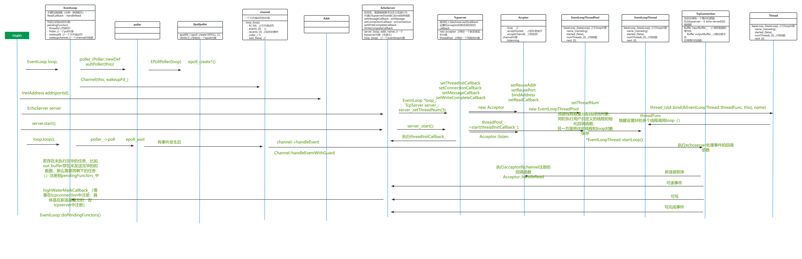

# C++11 miniMuduo

项目编译执行`./build.sh`即可，测试用例进入`example/`文件夹，`make`即可生成服务器测试用例

## 功能介绍

根据muduo库的设计理念完成了一个小型的网络库

1. 延续moduo库 muti reactor 和  one loop per thread + threadpool的理念
2. "EventLoop:" 封装了循环监听 ;"EventLoopThreadPool:"封装了线程池模块;"Tcpserver":负责接收上层的回调函数并一定程度上控制线程的启动；"TcpConnection":负责处理服务器的一系列行为，如连接到来，连接断开，信息到来，信息读完等；"TimerQueue":负责管理所有用户注册的定时器；"Channel":封装了套接字的一系列操作。
3. "AsyncLogging":用户可以使用LOG函数将信息输入到日志文件中，同时显示在终端上，内部使用了缓冲区来保存日志信息；

## 技术亮点

1. 实现了接收和发送的缓存区buffer类，可以更灵活的处理tcp字节序。
2. 实现了异步日志；可以将日志信息输入到日志文件中同时在终端显示日志信息
3. 实现了定时器功能，使用了set数据结构来维护定时器，并定义了定时器的增删改查功能。
4. 通过mutex上锁的机制，实现了线程安全的线程池，并使用了condition_variable，来管理线程池。

